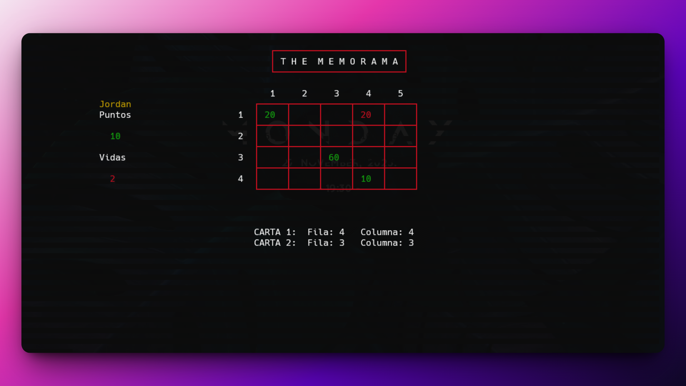

<h1 align="center">Juego de Memoria en C 🎴🧠</h1>

<p align="left">
  <a href="README.md" target="_blank">
    View README in English
  </a>
</p>

<p>Este repositorio contiene el código fuente de mi proyecto de laboratorio de Programación 1, donde desarrollé un juego de memoria (Memorama) en consola utilizando el lenguaje de programación C.
El objetivo principal de este proyecto fue practicar y reforzar mi comprensión de los arreglos unidimensionales y bidimensionales de una manera divertida e interactiva mediante el desarrollo de un juego.</p>

<h1 align="center">Tecnología Utilizada</h1>
<div align="center">
  
</div>
<hr>

<h1 align="center">Objetivo</h1>
<ul>
  <li>Aplicar programación estructurada en un proyecto real.</li>
  <li>Trabajar con <b>arreglos 1D y 2D</b> para gestionar los datos del juego.</li>
  <li>Diseñar un <b>juego de cartas de memoria completamente jugable</b> en la consola.</li>
</ul>
<hr>

<h1 align="center">Características Principales</h1>
<ul>
  <li><b>Tablero del juego</b> gestionado con <b>arreglos 2D.</b></li>
  <li><b>Datos de las cartas</b> manejados mediante <b>arreglos 1D.</b></li>
  <li><b>Interfaz de usuario simple</b> en la terminal.</li>
  <li>Interacción en tiempo real con lógica de volteo y coincidencia de cartas.</li>
  <li>Validaciones para asegurar un juego coherente y sin errores.</li>
</ul>
<hr>

<h1 align="center">Habilidades Adquiridas</h1>
<ul>
  <li>Profundicé mi comprensión sobre la <b>manipulación de arreglos en C.</b></li>
  <li>Fortalecí la lógica y el control de flujo usando <b>bucles y condicionales.</b></li>
  <li>Practiqué <b>operaciones de entrada/salida</b> en la línea de comandos.</li>
  <li>Apliqué una <b>estructura de código limpia</b> en un proyecto completo y autónomo.</li>
</ul>
<hr>

### Cómo Usar

1. Clona este repositorio en tu máquina local:

   ```sh
   git clone https://github.com/JordanMedinaOrtiz/memorama-c.git
   cd memorama-c
2. Compila el programa usando GCC u otro compilador compatible con C:
   ```sh
   gcc memorama.c -o memorama
   ```

3. Ejecuta el programa:
   ```sh
   gcc memorama.c -o memorama
   ```
4. ¡Juega y disfruta!

<p>Este proyecto, desarrollado de forma individual, fue una gran oportunidad para combinar mis conocimientos de programación con una aplicación real. Me permitió reforzar conceptos clave del lenguaje C como arreglos, condicionales y bucles, mientras construía algo interactivo y entretenido.</p>

